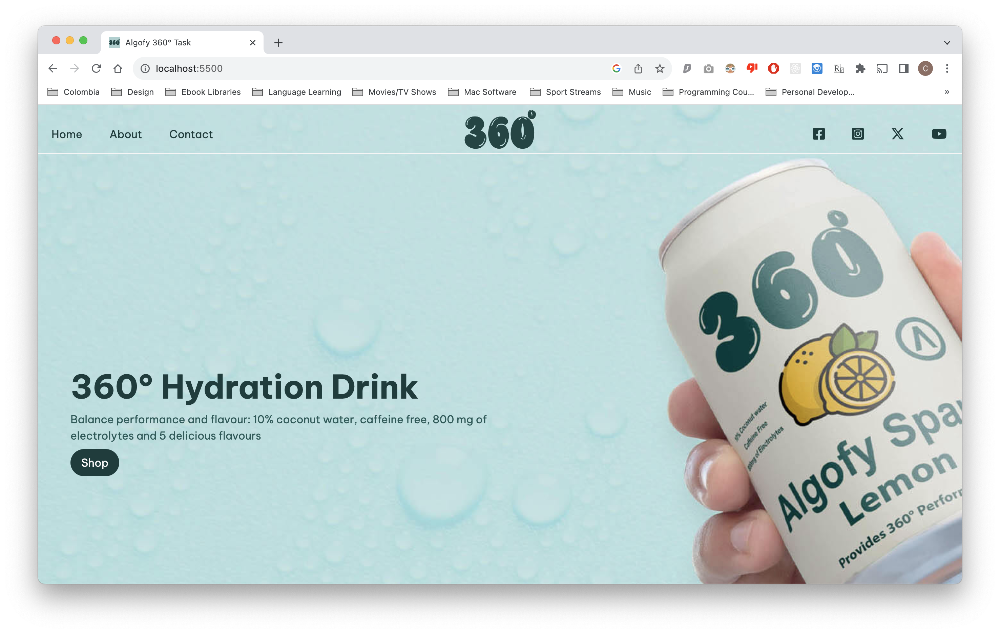
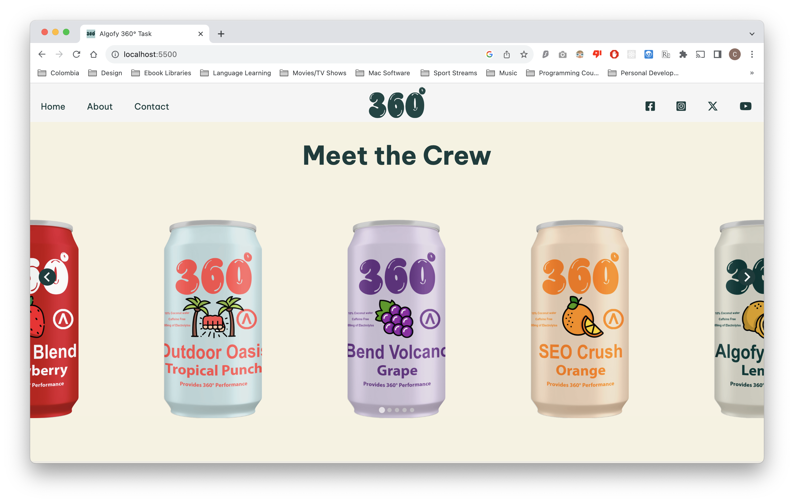
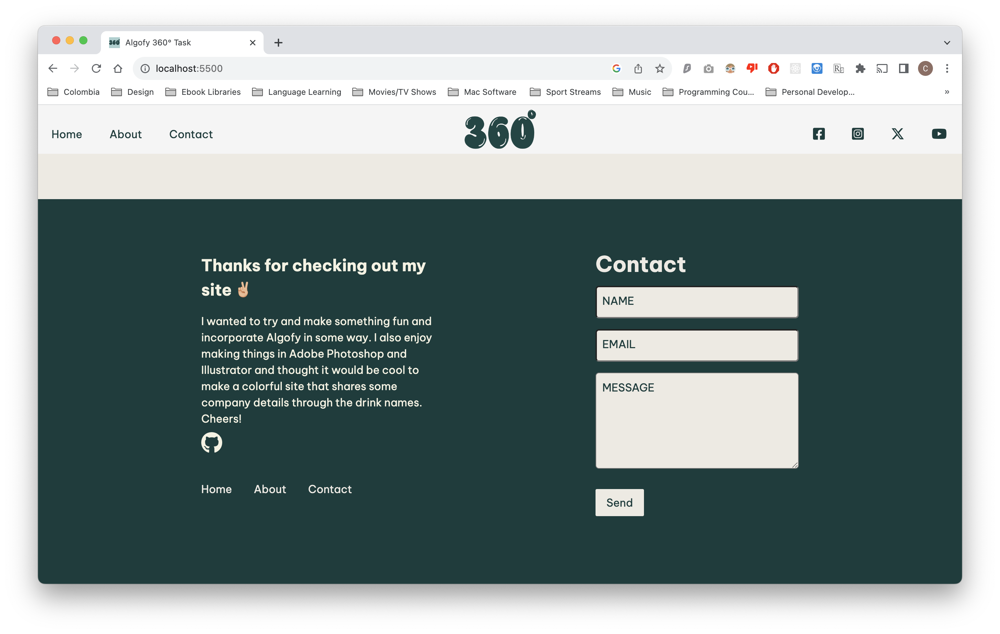

# Algofy Task
A responsive web page as a task assignment for Algofy, a 360° Performance Marketing Agency. I wanted to incorporate Algofy somehow in my design and decided on a fictional Algofy 360° Hydration Drink.

**Link to project:** https://algofy-task-six.vercel.app/

## How It's Made:

**Tech used:** HTML, CSS, JavaScript, Liquid

I started the task by thinking of a theme to build around. Once I had the idea of creating a fictional hydration drink website I started on laying out the structure of my HTML then the styling and after incorporating JavaScript. The task also called to use liquid which was a bit tricky getting it setup without a backend. Luckily I was able to find a LiquidJS which allows for use in browser. I had lots of fun designing this site and illustrations in Photoshop/Illustrator.

## Optimizations

There a quite a few optimizations that I would like to add in order to improve the overall user experience. 
  - With more time maybe adding some better animations to improve user experience.
  - Some more drinks to place in carousel.
  - Incorporate other pages on site.

## Getting Started
Clone repo and run using live server.

